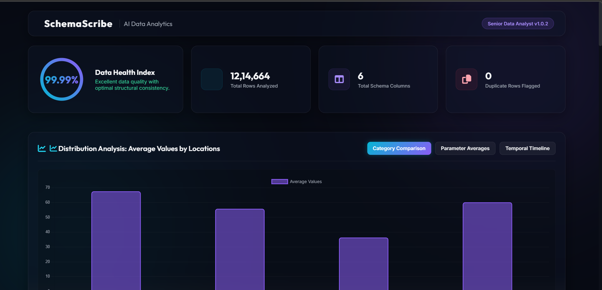
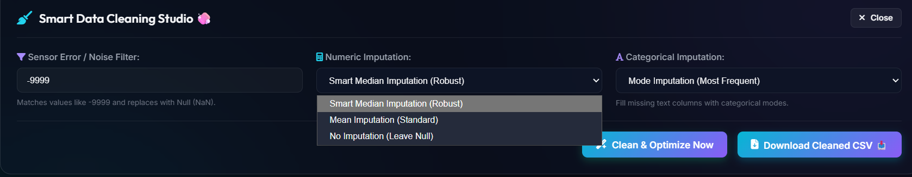
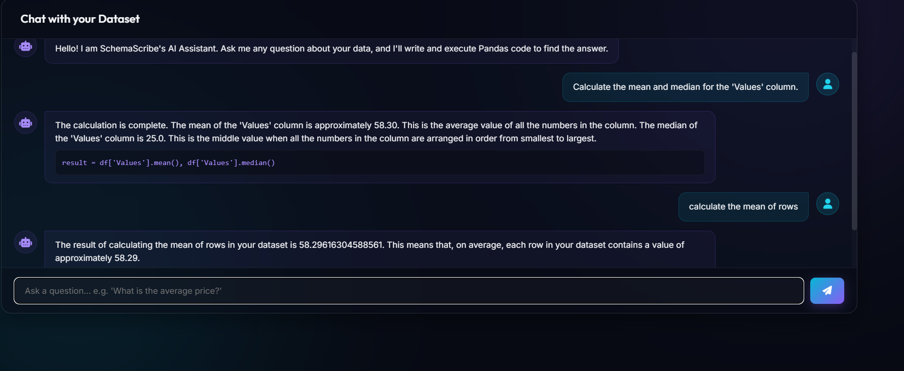

# 🧠 SchemaScribe AI 
**The Ultimate Intelligent Data Dictionary & Analytics Agent**

SchemaScribe AI is a revolutionary, enterprise-grade data analytics tool designed to eliminate the ambiguity of raw datasets. It automatically profiles massive datasets, detects data types, maps relationships, and uses **Agentic AI** to generate clear, human-readable business descriptions. 

Say goodbye to manual data cleaning and confusing schemas. Just drag, drop, and chat with your data!


---

## ✨ Enterprise-Grade Features

* 📊 **Automated Statistical Profiling:** Instantly processes `CSV`, `Excel`, and `JSON` files. Automatically calculates null ratios, cardinality, and detects pandas data types for up to millions of rows in seconds.
* 🤖 **AI-Powered Data Dictionary:** Leverages **Groq Llama-3.1 API** to generate rich, contextual business definitions and actionable cleaning recommendations for every column.
* 💻 **AI SQL DDL Generator:** Automatically generates `CREATE TABLE` scripts for PostgreSQL, MySQL, Snowflake, Oracle, and SQL Server.
* 🧼 **Smart Data Cleaning Studio:** One-click automated imputation for missing values and robust **IQR-based outlier mitigation** to ensure pristine data health.
* 💬 **Conversational Analytics (Agentic Sandbox):** Chat with your dataset in natural language! The AI translates your questions into Python Pandas code, executes it in a secure sandbox, and returns 100% mathematically accurate answers.
* 🗺️ **Multi-File ERD Visualizer:** Upload multiple datasets simultaneously. The semantic engine intelligently maps Primary and Foreign keys to generate stunning, interactive **Mermaid.js Entity-Relationship Diagrams (ERDs)**.
* 🎨 **Premium UI/UX:** Built with a breathtaking, Obsidian-inspired glassmorphism dark theme and smooth micro-animations.

---

## 🏗️ Tech Stack & Architecture

SchemaScribe AI utilizes a robust Client-Server architecture combining high-performance data processing with cutting-edge Large Language Models.

* **Frontend:** Vanilla HTML5, CSS3 (Glassmorphism), JavaScript, Chart.js, Mermaid.js
* **Backend:** Python, FastAPI, Uvicorn 
* **Data Engine:** Pandas, NumPy (for high-speed vectorized calculations)
* **AI Engine:** Groq Cloud API (Llama-3.1 8B Instant)

### 💡 Why an "Agentic Approach"?
Instead of passing millions of rows to an LLM (which exceeds token limits and causes math hallucinations), SchemaScribe AI uses an **Agentic execution loop**. The AI acts as a planner—it reads the schema, writes Pandas code, and the backend executes it. This guarantees **100% mathematical accuracy** while maintaining the conversational ease of a chatbot.

---

## 🚀 Installation & Setup

Follow these steps to run SchemaScribe AI on your local machine.

### Prerequisites
* Python 3.9+
* A free API key from [Groq Cloud](https://console.groq.com/)

### 1. Clone the Repository
```bash
git clone https://github.com/your-username/SchemaScribe-AI.git
cd SchemaScribe-AI
```

### 2. Install Dependencies
```bash
pip install -r requirements.txt
```

### 3. Configure Environment Variables
Create a `.env` file inside the `app/` directory and add your Groq API Key:
```env
GROQ_API_KEY=your_api_key_here
```

### 4. Run the Backend Server
```bash
python -m uvicorn app.main:app --host 0.0.0.0 --port 8000
```

### 5. Launch the Frontend
Simply double-click the `frontend/index.html` file in your browser, or use a tool like VS Code Live Server.

---

## 📸 Screenshots

### 1. Main Dashboard & Data Dictionary


### 2. Smart Data Cleaning Studio


### 3. Chat with Dataset (Conversational Analytics)


### 4. Multi-File ERD Visualizer


---

## 🤝 Contributing
Contributions, issues, and feature requests are welcome! Feel free to check the issues page.

## 📄 License
This project is [MIT](LICENSE) licensed.
# 🚀 SchemaScribe-AI Backend Repository
Looking for the Backend Engine & Agentic Sandbox code? 
👉 https://schemascribe-ai.onrender.com

